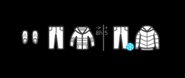
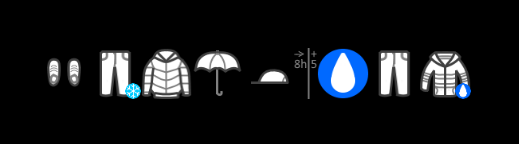

# Module: MMM-WeatherDependentClothes
This [MagicMirror](https://github.com/MichMich/MagicMirror) Module displays Clothes depending on the weather forecast and your personal preferences.
By default it will show recommondations for the next ~8 hours and additional recommondations (8+5) for the following ~5 hours (for when you are planning on a after work meeting).<br><br>
The `MMM-WeatherDependentClothes` module is based on the default `currentweather`module of the MagicMirror.

### Screenshot

- WeatherDependentClothes screenshot




### Installation
````
cd ~/MagicMirror/modules/
git clone https://github.com/fruestueck/MMM-WeatherDependentClothes.git
````

## Using the module

To use this module, add it to the modules array in the `config/config.js` file:
````javascript
modules: [
	{
		module: "MMM-WeatherDependentClothes",
		position: "top_right", // This can be any of the regions.
		config: {
			// See 'Configuration options' for more information.
			location: "Vienna,Austria",
			locationID: "", //Location ID from http://bulk.openweathermap.org/sample/city.list.json.gz
			appid: "abcde12345abcde12345abcde12345ab", //openweathermap.org API key.
			preferences: [
				{
				    name: "Winter jacket",
				    icon: "jacket-cold",
				    conditions: {
					temp_max: 2.0,
				    }
				},
				// more items here. See .js for default list
			]
		}
	}
]
````

## Configuration options

The following properties can be configured:


| Option                       | Description
| ---------------------------- | -----------
| `location`                   | The location used for weather information. <br><br> **Example:** `'Amsterdam,Netherlands'` <br> **Default value:** `false` <br><br> **Note:** When the `location` and `locationID` are both not set, the location will be based on the information provided by the calendar module. The first upcoming event with location data will be used.
| `locationID`                 | Location ID from [OpenWeatherMap](https://openweathermap.org/find) **This will override anything you put in location.** <br> Leave blank if you want to use location. <br> **Example:** `1234567` <br> **Default value:** `false` <br><br> **Note:** When the `location` and `locationID` are both not set, the location will be based on the information provided by the calendar module. The first upcoming event with location data will be used.
| `appid`                      | The [OpenWeatherMap](https://home.openweathermap.org) API key, which can be obtained by creating an OpenWeatherMap account. <br><br>  This value is **REQUIRED**
| `units`                      | What units to use. Specified by config.js <br><br> **Possible values:** `config.units` = Specified by config.js, `default` = Kelvin, `metric` = Celsius, `imperial` =Fahrenheit <br> **Default value:** `config.units`
| `updateInterval`             | How often does the content needs to be fetched? (Milliseconds) <br><br> **Possible values:** `1000` - `86400000` <br> **Default value:** `20*60*1000` (20 minutes)
| `animationSpeed`             | Speed of the update animation. (Milliseconds) <br><br> **Possible values:**`0` - `5000` <br> **Default value:** `3000` (3 seconds)
| `lang`                       | The language of the fetched weatherstatus (e.g. `heavy rain`). <br><br> **Possible values:** `en`, `nl`, `ru`, etc ... <br> **Default value:** uses value of _config.language_
| `initialLoadDelay`           | The initial delay before loading. If you have multiple modules that use the same API key, you might want to delay one of the requests. (Milliseconds) <br><br> **Possible values:** `1000` - `5000` <br> **Default value:**  `1000`
| `retryDelay`                 | The delay before retrying after a request failure. (Milliseconds) <br><br> **Possible values:** `1000` - `60000` <br> **Default value:**  `4500`
| `apiVersion`                 | The OpenWeatherMap API version to use. <br><br> **Default value:**  `2.5`
| `apiBase`                    | The OpenWeatherMap base URL. <br><br> **Default value:**  `'http://api.openweathermap.org/data/'`
| `weatherEndpoint`	           | The OpenWeatherMap API endPoint. <br><br> **Default value:**  `'forecast'`
| `forecastResultLimit`	           | Defines amount of forecast data sets to be fetched. The clothing preferences are matched against these data sets. <br><br> **Default value:**  `4` <br><br> **Note:** Each data set is three hours apart and the first set may be up to 3 hours old. (e.g. `4` fetches 4*3: forecast of next 9 to 12 hours)
| `forecastResultLimitExtended`	           | Defines amount of extended forecast data sets to be fetched. <br><br> **Default value:**  `2` <br><br> **Note:** If this is not `0` (Zero) and the weather is significantly changing after the `forecastResultLimit` data sets, additional clothing recommondations are displayed (after the `iconSeperator`).
| `logForecastResults`	           | Log weatherForecastResults to console if `true`. <br><br> **Default value:**  `false`
| `iconPath`	           | The path to the icons folder. <br><br> **Default value:**  `'icons/'`
| `iconScale`	           | Scale of PNG icons (1 stands for 100%). <br><br> **Default value:**  `1`
| `iconSize`	           | Define iconSize for PNG icons. <br><br> **Default value:**  `64`
| `iconSeperator`	           | The filename of the iconSeperator showed for `forecastResultLimitExtended` results. <br><br> **Default value:**  `'extendedForecastSymbol00'`
| `preferences`	           | Define a list of clothes and conditions to be matched. <br><br> **Default value:**  see clothing prefereces

### Clothing preferences
Define a list of clothes to be matched against the (extended) weather forecast. Each list element represents one clothing based on weather `conditions`.

Examples:
````
preferences: [
        {
            name: "Winter jacket",
            icon: "jacket-cold",
            conditions: {
                temp_max: 2.0,
            },
        },
        {
            name: "Jacket",
            icon: "jacket",
            conditions: {
                temp_min: 2.0,
                temp_max: 9.0,
                rainfall_max: 3,
            },
        },
        {
            name: "Rain jacket",
            icon: "jacket-wet",
            conditions: {
                temp_min: 2.0,
                temp_max: 9.0,
                rainfall_min: 3,
            },
        },
    [...]
]
````
<b>Example description:</b> The winter jacket will be displayed when the temperature is below 2 degree celsius.
The Jacket between 2 and 9 degrees, while rainfall below 3mm and the rain jacket with rainfall above 3mm and temperature between 2 and 9 degrees.

| Option                       | Description
| ---------------------------- | -----------
| `name`                   | Label describing the clothing. Will be displayed on missing icon. <br><br> **Example:** `'Rain jacket'` <br> **Default value:** `icon`-value
| `icon`                   | Icon located in `iconPath` to be displayed, representing the clothing. <br><br> **Example:** `'jacket-wet'` **required**
| `conditions`                   | List with `conditions`. <br><br> **Example:** see js file <br> **Default empty**

### Clothing conditions
Each condition defined has to be matched in order to display the clothing.

| Option                       | Condition fullfilled if forecast ...
| ---------------------------- | -----------
| `temp_min`                   | temperature [in °] above this value. <br> **Example:** `2.0`
| `temp_max`                   | temperature [in °] below this value. <br> **Example:** `9.0`
| `rainfall_min`                   | rainfall [in mm]above this value. <br> **Example:** `3`
| `rainfall_max`                   | rainfall [in mm] below this value. <br> **Example:** `3`
| `windspeed_min`                   | rainfall [in m/s] above this value. <br> **Example:** `3`
| `windspeed_max`                   | rainfall [in m/s] below this value. <br> **Example:** `3`
| `cloudDensity_min`                   | cloudDensity [in %] above this value. <br> **Example:** `50`
| `cloudDensity_max`                   | cloudDensity [in %] below this value. <br> **Example:** `100`
| `weather`                   | weather type matches this value. <br><br> **Example:** `'clouds'`  <br> **Possible values:** clouds, rain, snow, extreme, thunderstorm,... <br><br> **Note:** View [openweathermap conditions](https://openweathermap.org/weather-conditions) for possible values.

## Future Work
The project would benefit from the following features. Feel free to improve the module and create a PR.

- support for vector graphics
- general code improvements
- additional clothing conditions
